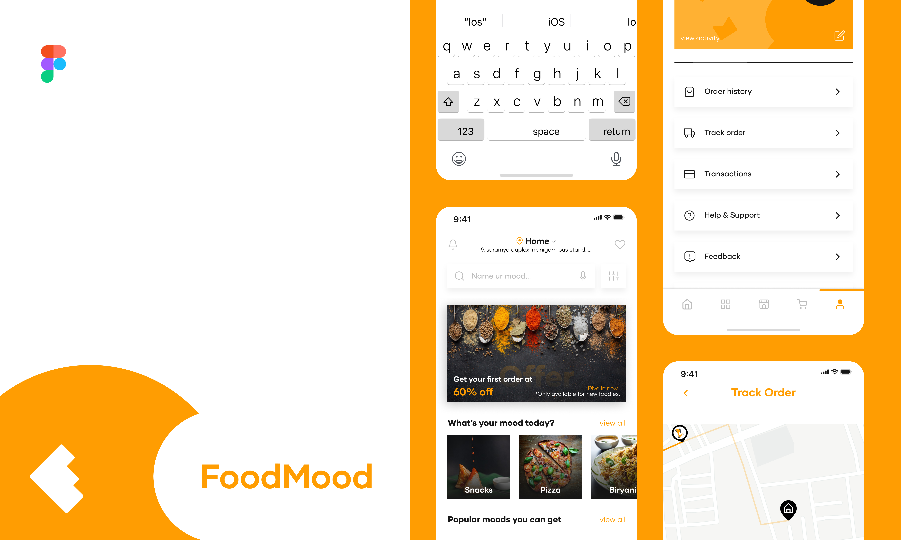

<p align="center">
  
</p>

<hr>

## Application to order foods



---

## ⚙️ Setup project
- Clone the repository
- First make sure you have expo installed
- Open the project
- Run (npm, pnpm, ..., wich you prefer) install
- Run ```npx expo start```
- Now you can see our project :)

<br>

---

## 🔖 Layout

You can view the project layout through the links below:

- [Layout](<https://www.figma.com/community/file/1195830433502411741>)

Remembering that you need to have a [Figma](http://figma.com/) account to access it.

<br>

---

Developed by [ricardorhv](https://github.com/ricardorhv) and [GuiSonsin](https://github.com/GuiSonsin)